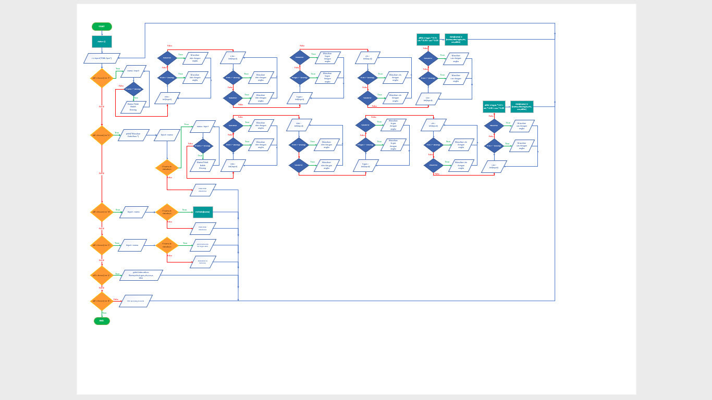
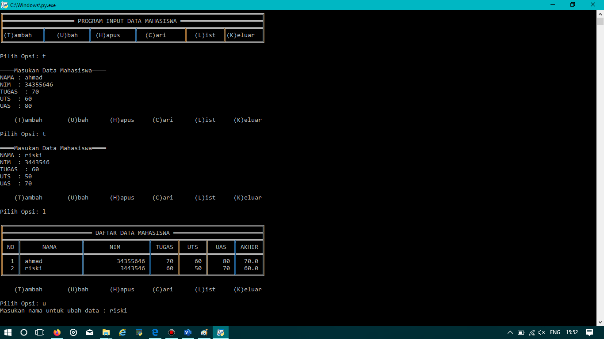
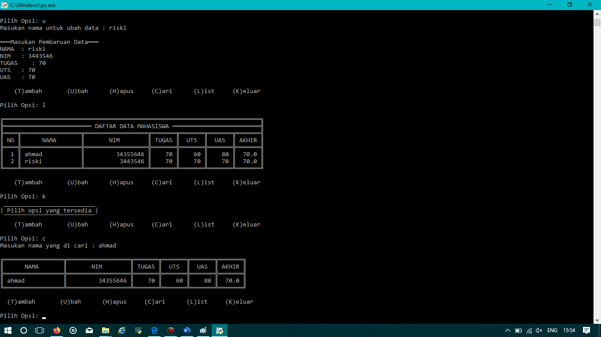

.:Penjelasan Program 5:.

1.Deklarasi dictionary data
2.Input untuk pilih opsi
(A)dd (E)dit (D)elete (S)earch (L)ist (Q)uit

3.Jika Input T

    1.Input nama,nim,tugas,uts,uas
    2.Nilai akhir perpaduan nilai tugas,uts,uas
    3.Jika nilai nim,tugas,uts,uas, kosong/tidak di isi dengan angka maka ValueError dan meminta input ulang
    4.semua data akan di tambahkan menjadi value dan key menggunakan nama

4.Jika Input U

    1.Input nama/key yg di cari
    2.Jika nama ada di data.keys
       - Input pembaruan data
       - Jika nilai nim,tugas,uts,uas, kosong/tidak di isi dengan angka maka ValueError dan meminta input ulang
       - Input akan menimpa data yang lama
    3.Jika tidak
       - Data tidak di temukan

5.Jika Input H

    1.Input nama/key yg di cari
    2.Jika nama ada di data.keys
     - Maka datanya akan di hapus
    3.Jika tidak
     - Data tidak di temukan

6.Jika Input C

    1 Input nama/key yg di cari
    2 Jika nama ada di data.keys
      -Print nama,nim,uts,tugas,akhir
      -Data tidak di temukan

7.Jika Input L

   -Print data.values / memanggil semua values

8.Jika Input K

   -Program Berhenti

9.Jika Input diluar, A,E,D,S,L,Q

   -Pilih opsi yang tersedia
   
   tampilan flow chart:
   
   
   
   tampilan hasil:
   
   
   
   
